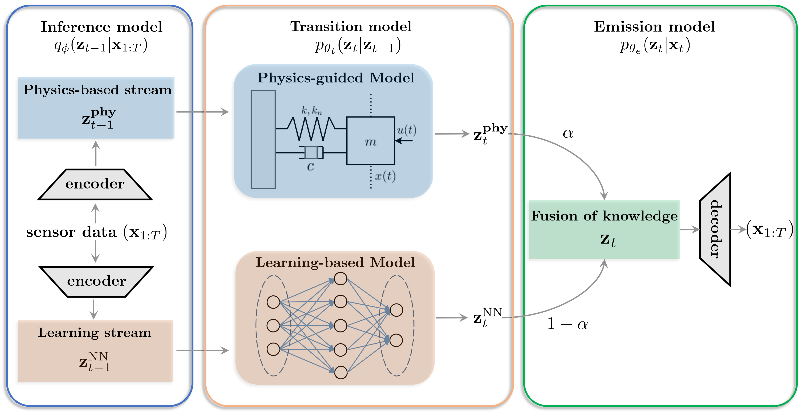

# Physics-guided Deep Markov Models (PgDMM)
 
This repository contains codes and data for the following publication:
* Wei Liu, Zhilu Lai, Kiran Bacsa, and Eleni Chatzi (2022). [Physics-guided Deep Markov Models for learning nonlinear dynamical systems with uncertainty](https://doi.org/10.1016/j.ymssp.2022.109276). Mechanical Systems and Signal Processing, 178, 109276.

PgDMM is a hybrid modeling framework for unsupervised learning and identification of nonlinear dynamical systems. The proposed framework takes advantage of the expressive power of deep learning, while retaining the driving physics of the dynamical system by imposing physics-driven restrictions on the side of the latent space.

## Framework


## Repository Overview
 * `silverbox_pgdmm` - Codes for implementing PgDMM on Silverbox benchmark.
   * `data_loader.py` - Functions for loading and processing raw data.
   * `loss.py` - Analytical loss functions.
   * `models.py` - PgDMM models.
   * `training.py` - Manages training and evaluation of models.
   * `silverbox_main.py` - Configuration for training PgDMM models on Silverbox benchmark.
 * `silverbox_dmm` - Codes for implementing DMM on Silverbox benchmark.
   * `data_loader.py` - Functions for loading and processing raw data.
   * `loss.py` - Analytical loss functions.
   * `models.py` - DMM models.
   * `training.py` - Manages training and evaluation of models.
   * `silverbox_main.py` - Configuration for training DMM models on Silverbox benchmark.

## Citation
Please cite the following paper if you find the work relevant and useful in your research:
```
@article{liu2022physics,
  title={Physics-guided deep Markov models for learning nonlinear dynamical systems with uncertainty},
  author={Liu, Wei and Lai, Zhilu and Bacsa, Kiran and Chatzi, Eleni},
  journal={Mechanical Systems and Signal Processing},
  volume={178},
  pages={109276},
  year={2022},
  publisher={Elsevier}
}
```
